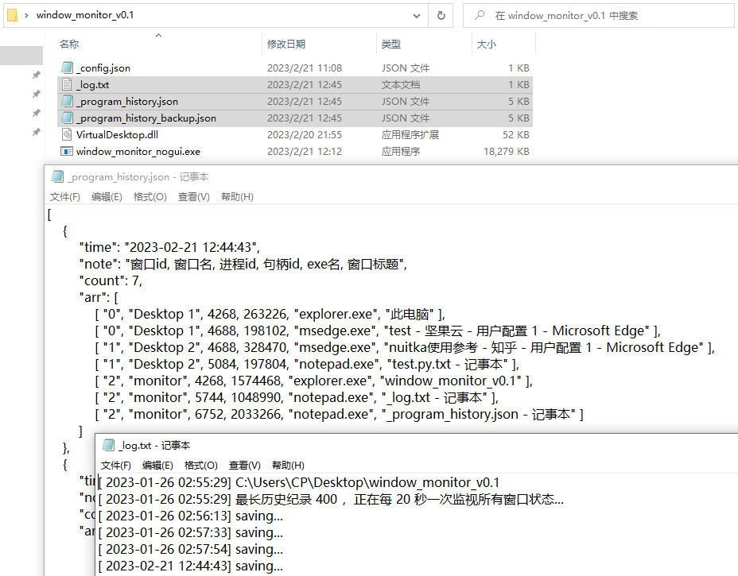

# window_monitor

监控所有窗口，并记录到json文件，当资源管理器崩溃或者系统重启，可以查看json恢复你的工作

## 编译和运行方法（手动版）

```cmd
pyinstaller打包：
pyinstaller.exe -F -c --noupx window_monitor.py 

nuitka打包：知乎 nuitka：https://zhuanlan.zhihu.com/p/165978688
nuitka --standalone --onefile --windows-disable-console window_monitor.py -o window_monitor_nogui.exe

VirtualDesktop.dll编译：
C:\Windows\Microsoft.NET\Framework\v4.0.30319\csc.exe /target:library /out:VirtualDesktop.dll VirtualDesktop.cs

运行方式：
pythonw window_monitor.py（不推荐）
Start-Process -WindowStyle Hidden .\window_monitor.exe (文件名：run_with_new_process.ps1)（不推荐）
window_monitor_nogui.exe （推荐）

```

## 运行方法（简洁版）

- 从 releases 下载最新的 window_monitor_vXX.zip，解压
- 将文件夹放置在合适的位置
- 双击 window_monitor_nogui.exe 运行
- 运行后没有界面，同目录下会生成 `_log.txt` `_program_history.json` `_program_history_backup.json` 三个文件
- 如果要结束程序，可以打开任务管理器，详细信息，找到 window_monitor_nogui.exe，结束任务

## 运行效果



## 相关repo

MScholtes/VirtualDesktop:  [https://github.com/MScholtes/VirtualDesktop](https://github.com/MScholtes/VirtualDesktop)
