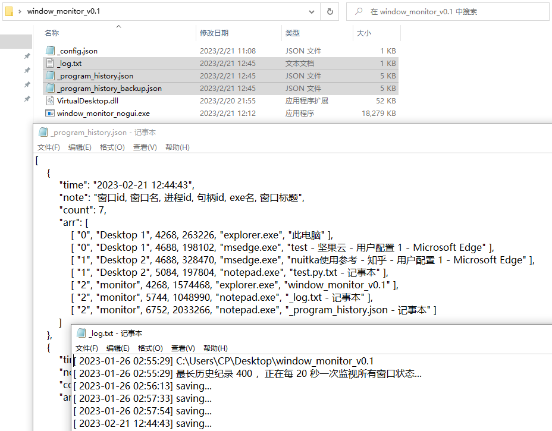

# window_monitor

窗口记录工具，定期记录所有窗口，并记录到json文件，当资源管理器崩溃或者系统重启，可以查看json恢复你的工作

## 编译和运行方法（手动版）

```cmd
pyinstaller打包：（不推荐）
pyinstaller.exe -F -c --noupx window_monitor.py 


nuitka打包：（推荐）
知乎 nuitka：https://zhuanlan.zhihu.com/p/165978688
nuitka --standalone --onefile --windows-disable-console window_monitor.py -o window_monitor_nogui.exe

上面命令行使用旧版本1.4.7。nuitka 2.4.5 要求使用新的参数名，因此命令行为：
nuitka --standalone --onefile --windows-console-mode=disable window_monitor.py -o window_monitor_nogui.exe

nuitka打包时可以加入版本信息等，可以在参数中给出。同时nuitka支持`# nuitka-project:`这样的代码内注释，相关参数可以在python文件顶上给出。改进后命令行为：
nuitka window_monitor.py


VirtualDesktop.dll编译：
C:\Windows\Microsoft.NET\Framework\v4.0.30319\csc.exe /target:library /out:VirtualDesktop.dll VirtualDesktop.cs


python运行时先安装需要的库：
pip install -r .\requirements.txt

运行方式：
pythonw window_monitor.py（不推荐）
Start-Process -WindowStyle Hidden .\window_monitor.exe (文件名：run_with_new_process.ps1)（不推荐）
window_monitor_nogui.exe （推荐）

```

## 运行方法（简洁版）

- 从 releases 下载最新的 window_monitor_vXX.zip，解压
- 将文件夹放置在合适的位置
- 双击 window_monitor_nogui.exe 运行
- 运行后没有界面，同目录下会生成 `_log.txt` `_program_history.json` `_program_history_backup.json` 三个文件
- 如果要结束程序，可以打开任务管理器，详细信息，找到 window_monitor_nogui.exe，结束任务

## json配置文件

`_config.json` 为配置文件，运行前可能需要根据需求或环境来设置合适的值。

样例内容：

```json
{
    "max_history_length": 400,
    "seconds_per_loop": 20,
    "VirtualDesktop_DLL_name": "VirtualDesktop_v1.18"
}
```

参数说明：

- **max_history_length**：历史记录最大状态数量，超过将去除最旧的状态
- **seconds_per_loop**：间隔时间，每隔此时间监测一次窗口状态
- **VirtualDesktop_DLL_name**：对应VirtualDesktopDLL文件夹中的dll路径，与Windows版本有关，根据Windows版本选择对应的dll。注意不带目录路径和后缀名
  - `VirtualDesktop_v1.18`：适用于Windows 10
  - `VirtualDesktop11_v1.18`：适用于Windows 11
  - `VirtualDesktop11_24H2_v1.18`：适用于Windows 11 24H2
  - 如有其他版本Windows或DLL修改后仍然不能正常获取窗口，可以提交反馈。

&nbsp;

`_config_title_replace.json` 为记录标题的特殊替换规则，用户可以自定义标题中出现特定模式时修改保存的标题内容。例如 BitComet比特彗星 在下载时就会随时修改标题，显示下载速度，导致本程序经常因为它的标题的修改（对于本程序来说接近于无意义且变动太频繁）而保存大量的状态，可能会挤占历史状态导致丢失一些稍早的。因此设计了此功能使用户可以配置标题字符串替换。

样例内容：

```json
[
    {
        "condition_string": "BitComet(比特彗星) (64-bit)",
        "re_condition_pattern": "BitComet\\(比特彗星\\) \\(64-bit\\)",
        "re_replace_old": "下载:[^,]+, 上传:[^-]+",
        "re_replace_new": "下载:XX/s, 上传:XX/s "
    }
]
```

参数说明：

包含以下四个字段的一个字典为一条规则，可以添加多条规则，程序逐个匹配处理。

- **condition_string**：匹配标题是否要进行替换的，普通字符串，与正则字符串之间二选一或二选二，匹配一次进行一次替换
- **re_condition_pattern**：匹配标题是否要进行替换的，正则字符串，与普通字符串之间二选一或二选二，匹配一次进行一次替换
- **re_replace_old**：正则替换（re.sub()）的匹配字符串片段，旧字符串
- **re_replace_new**：正则替换（re.sub()）的替换字符串片段，新字符串

## 运行效果



## 相关repo

MScholtes/VirtualDesktop:  [https://github.com/MScholtes/VirtualDesktop](https://github.com/MScholtes/VirtualDesktop)
